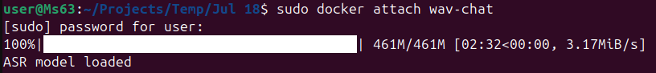
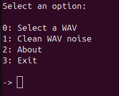
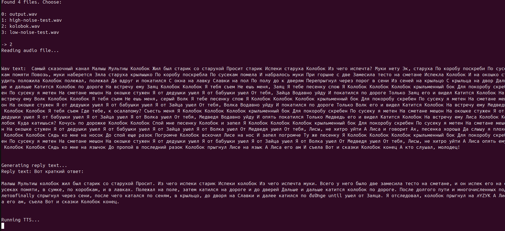

# wav-chat

## Table of Contents
+ [About](#about)
+ [Getting Started](#getting_started)
+ [Usage](#usage)
+ [Additional Info](#additional_info)

## About <a name = "about"></a>
ML project combining ASR with LLM to create audio chatting experience, all completely local

## Getting Started <a name = "getting_started"></a>
These instructions will get you a copy of the project up and running on your local machine for development and testing purposes. See [deployment](#deployment) for notes on how to deploy the project on a live system.

### Prerequisites

- Python 3.12.3
- Pip
- Ollama
- ~10GB of free space

### Installing

A step by step series of examples that tell you how to get a development env running.

Create project folder

```sh
mkdir wav-chat
```
```sh
cd wav-chat
```

Clone this repository

```sh
git clone https://github.com/CalifornianNightmare/wav-chat
```

Set up virtual enviroment and log in

```sh
python -m venv .venv
```
```sh
source .venv/bin/activate
```

Install requirements

```sh
pip install --no-cache-dir -r requirements.txt
```

Install the ollama model that will be used (`Llama3.2:1b` by default, but configurable in `.env`)

```sh
ollama pull llama3.2:1b
```

Run the app

```sh
python app.py
```

### Runing in Docker <a name = "deployment"></a>

Open `.env`, and uncomment the `OLLAMA_HOST` variable to connect to ollama, rather than localhost. 

In the end, it should look like this:

```sh
### Local ollama connection
# OLLAMA_HOST='http://localhost:11434'
### Docker ollama connection
OLLAMA_HOST='http://ollama:11434'
```

Build the images

```sh
docker compose build
```

Run docker compose

```sh
docker compose up -d
```

Attach the terminal interface

```sh
docker attach wav-chat
```

Run app container in bash (For debugging purposes)

```sh
docker exec -it wav-chat /bin/bash
```

To exchange `.wav` files with the container, use the newly generated `/wav-chat/docker/files` folder


## Usage <a name = "usage"></a>

> ### Select a WAV

Searches for a WAV, transforms it to text, returns an llm summary voiced by tts

The files are read from and saved to the `/files/` folder. Only `.wav` types are allowed

> ### Clean WAV noise

Selects a WAV file and uses noise cancellation. Saves back by the same name

The files are read from and saved to the `/files/` folder. Only `.wav` types are allowed

> ### About

Shows short info box about the app

> ### Exit

Exits the app

## Additional Info <a name = "additional_info"></a>

> ### .env

Enviromental variables include:

- **DEVICE** - Device for torch to connect to (CUDA/GPU/CPU) (CPU by default)
- **VERB** - Information wav-chat outputs to the console (0-2) (2 by default)
- **LLM_MODEL_VERSION** - LLM model used to generate answer. By default llama3.2, but can be switched for a more productive one
- **OLLAMA_HOST** - Host to provide ollama connection

> ### Screenshots







> ### Scalability

As of now, the llm is easily replacable with any ollama model by changing `.env`. Ollama itself allows for an easily implementable chatting feature and docker allows it to scale horisontally

Same with TTS. The biggest bottleneck would be ASR.

> ### Default models

`whisper-small` -> `llama3.2:1b` -> `silero_tts`

Noise reduction: `spectral gating` alghoritm

> ### Project tree

Next commit